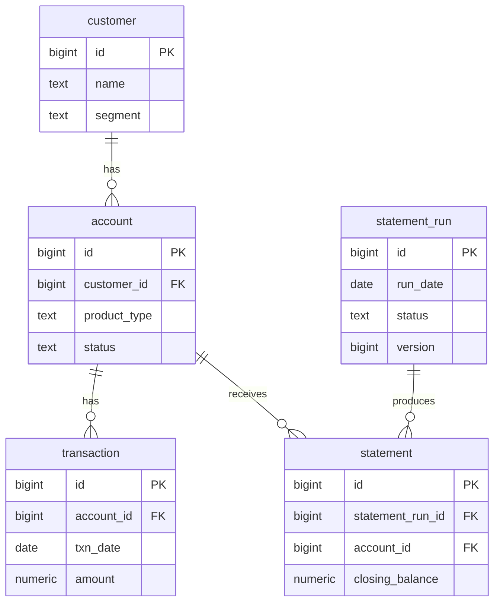

# statement-forge

**A high-volume customer statement engine — built as a PostgreSQL / Hibernate performance
engineering case study.**

A Spring Boot service that generates personalised customer statements (bank/insurance
style) over a **~5M-row PostgreSQL dataset**, supporting both a batch run ("generate
statements for all accounts for period X") and an on-demand single-statement path.

The application is deliberately modest. **The deliverable is [`PERFORMANCE.md`](PERFORMANCE.md)** —
a set of measured before/after investigations (N+1, indexing, keyset pagination, JDBC
batch inserts, ORM vs native SQL, optimistic locking), each backed by real
`EXPLAIN (ANALYZE, BUFFERS)` output and timings. Design rationale lives in
[`DECISIONS.md`](DECISIONS.md).

> Personal learning project, built in ~1 day with AI assistance (Claude Code). All
> numbers are real, measured on my machine, and regenerable — nothing is invented.

## Headline results

| Investigation | Before | After |
|---|---|---|
| N+1 statement generation (1k accounts) | `[N]` queries, `[X]s` | `[M]` queries, `[Y]s` |
| Range query, no index vs composite index | seq scan, `[X]ms` | index scan, `[Y]ms` |
| Deep pagination (page 10,000) | OFFSET `[X]ms` | keyset `[Y]ms` |
| Batch insert throughput | `[X]` rows/s | `[Y]` rows/s (`[N]×`) |

## Quickstart

```bash
docker compose up
```

First start seeds ~5M transaction rows via Flyway (takes 1–3 minutes). Then:

```bash
# batch: generate statements for March 2025 (choose a strategy to compare)
curl -X POST "localhost:8080/api/statement-runs?period=2025-03&strategy=NAIVE&limitAccounts=1000"
curl -X POST "localhost:8080/api/statement-runs?period=2025-03&strategy=NATIVE_SQL"
```

<!-- TODO(M10): full endpoint table -->

## Schema



## Stack

Java 21 · Spring Boot 4.1 · Spring Data JPA (Hibernate) · PostgreSQL 16 · Flyway ·
Docker Compose · Testcontainers
