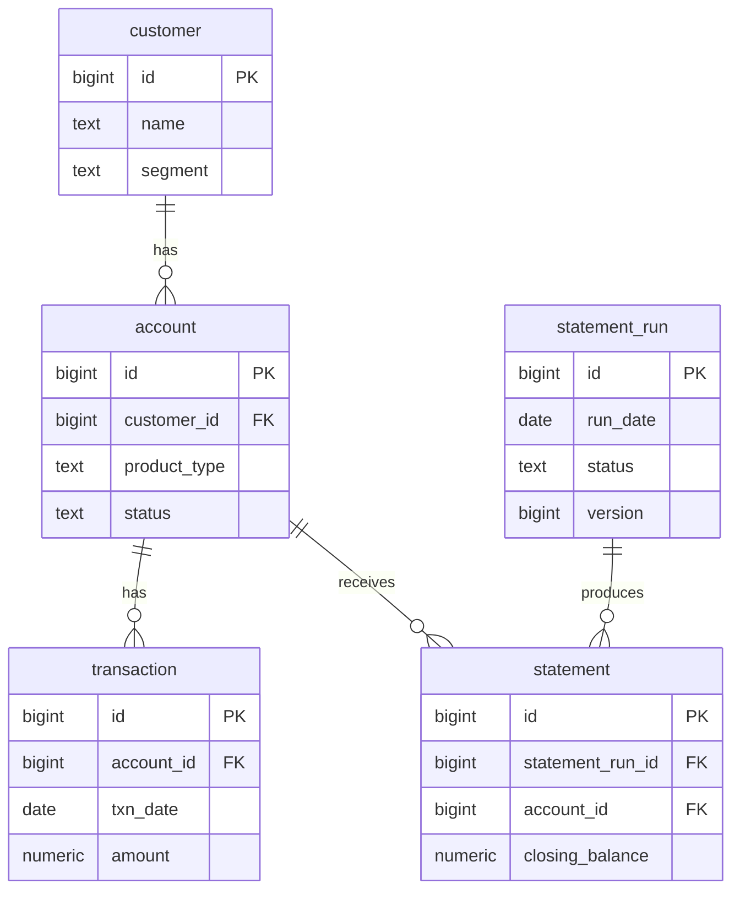

# statement-forge

**A high-volume customer statement engine — built as a PostgreSQL / Hibernate performance
engineering case study.**

A Spring Boot service that generates personalised customer statements (bank/insurance
style) over a **~5M-row PostgreSQL dataset**, supporting both a batch run ("generate
statements for all accounts for period X") and an on-demand single-statement path.

The application is deliberately modest. **The deliverable is [`PERFORMANCE.md`](PERFORMANCE.md)** —
a set of measured before/after investigations (N+1, indexing, keyset pagination, JDBC
batch inserts, ORM vs native SQL, optimistic locking), each backed by real
`EXPLAIN (ANALYZE, BUFFERS)` output and timings. Design rationale lives in
[`DECISIONS.md`](DECISIONS.md).

> Personal learning project, built in ~1 day with AI assistance (Claude Code). All
> numbers are real, measured on my machine, and regenerable — nothing is invented.

## Headline results

| Investigation | Before | After |
|---|---|---|
| N+1 in statement generation (1k accounts) | 2,003 queries, 207.5s | 670 queries, 2.49s (~83×) |
| Range query, no index vs composite index | Parallel Seq Scan, 287.9ms | Index Scan, 0.204ms (~1,411×) |
| Deep pagination (depth 10,000) | OFFSET ~118ms, grows with depth | keyset ~13.7ms, flat at any depth (~528× DB-side) |
| Batch insert throughput (20k accounts) | 306.16 rows/s (`IDENTITY`; `batch_size` alone: 303.72 — no change) | 1,164.27 rows/s (`SEQUENCE` + batch + rewrite, ~3.8×) |
| Row-by-row batch vs set-based native SQL (20k accounts) | 11,426ms (`BATCHED`) | 2,071ms (`NATIVE_SQL`, ~8.3×) — full 200k accounts in 9.6s |
| Optimistic locking on concurrent status update | silent lost update, no error | `409 Conflict`, version-guarded |

Full write-up, `EXPLAIN` plans, and raw evidence for every row: [`PERFORMANCE.md`](PERFORMANCE.md).

## Quickstart

```bash
docker compose up
```

First start builds the app image, then seeds ~5M transaction rows via Flyway (takes
1–3 minutes — watch the logs, or run `docker compose logs -f app`). Once you see
`Started StatementForgeApplication`, the API is live at `localhost:8080`:

```bash
# batch: generate statements for March 2025 (choose a strategy to compare)
curl -X POST "localhost:8080/api/statement-runs?period=2025-03&strategy=NAIVE&limitAccounts=1000"
curl -X POST "localhost:8080/api/statement-runs?period=2025-03&strategy=NATIVE_SQL"
```

To reset to a pristine seeded database at any point: `docker compose down -v` then
`docker compose up` again (Flyway reapplies the same deterministic seed).

For local development against an IDE (hot reload, debugger attached), run
`./mvnw spring-boot:run` instead — `spring-boot-docker-compose` starts just the
`postgres` service automatically (the `app` service is labelled
`org.springframework.boot.ignore` so it doesn't also try to start itself).

## Endpoints

| Method | Path | Purpose |
|---|---|---|
| `POST` | `/api/statement-runs?period={yyyy-MM}&strategy={NAIVE\|FETCH_JOIN\|BATCHED\|NATIVE_SQL}&limitAccounts={n}` | Run the batch statement generator with a chosen strategy (default `limitAccounts=1000`) |
| `GET` | `/api/statement-runs/{id}` | Read a run's status, version, and statement count |
| `PATCH` | `/api/statement-runs/{id}` | Transition a run's status (`@Version`-guarded — concurrent conflict → `409`) |
| `GET` | `/api/accounts/{accountId}/transactions?from={date}&to={date}` | Date-range transaction lookup for one account (composite-index demo) |
| `GET` | `/api/accounts/{accountId}/statements/{period}/lines` | Per-transaction running balance through a period (native SQL window function) |
| `GET` | `/api/transactions?page={n}&size={n}` | Deep transaction listing, OFFSET pagination |
| `GET` | `/api/transactions?afterId={id}&size={n}` | Deep transaction listing, keyset (cursor) pagination |

## Schema



## Stack

Java 21 · Spring Boot 4.1 · Spring Data JPA (Hibernate) · PostgreSQL 16 · Flyway ·
Docker Compose · Testcontainers
